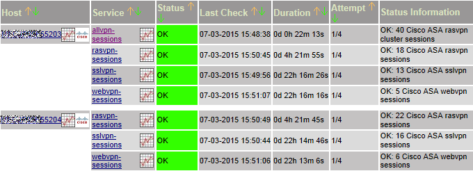
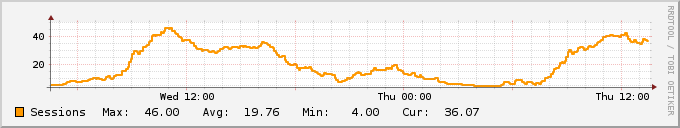

# check_asa_sessions.sh

## Man page for the Nagios plugin check_asa_sessions.sh

Copyright (c) 2015 Frank4DD<support[at]frank4dd.com>

### check_asa_sessions.sh

This plugin checks the number of VPN sessions on Cisco ASA appliances (e.g. 5525). This can be used to monitor the VPN usage over time, and pro-actively manage VPN license and device load. Thanks to Cisco's detailled SNMP MIB, we can monitor separately for IPsec, SSL-VPN and clientless WebVPN sessions. The plugin has a switch to count data over a redundand, load-sharing VPN cluster.

### Usage:

`./check_asa_sessions.sh -H <hostname> -C <community> -T <type> -w <warning-value> -c <critical-value> [-u <cluster-IP>] | -h`

### Options:

-H, --hostname  
      Hostname (required)

-C, --community  
      SNMP Community (required)

-T, --type  
      ipsec | sslvpn | webvpn | rasvpn

-u, --cluster  
      add the IP addresses of the remaining VPN cluster members. This option will count the sessions over all members and return the summary

-w  
      The total number of blocked IP considered for warning

-c  
      The total number of blocked IP considered critical

-t, --timeout  
      The SNMP timeout value in seconds (defaults to 15)

-h  
      Displays the plugin usage

### Plugin Usage Example:

Commandline output:

<pre class="code"># /srv/app/nagios/lib/check_asa_sessions.pl -H 192.168.10.31 -C NAGro -t sslvpn -w 40 -c 80
OK: 39 Cisco ASA sslvpn sessions</pre>

Nagios plugin call definition in commands.cfg:

    define command{
      command_name check_asa_sessions
      command_line $USER1$/check_asa_sessions.sh -H $HOSTNAME$ -C $ARG1$ -t $ARG2$ -w $ARG3$ -c $ARG4$
    }

Nagios plugin service definition, e.g. security-services.cfg:

    #######################################################################
    # Check ASA VPN sessions
    #######################################################################
    define service {
      use                           generic-security
      host_name                     susie
      service_description           sslvpn-sessions
      check_command                 check_asa_sessions!NAGro!sslvpn!40!80
    }

### Nagios Output:

Exemplary output for a VPN cluster, providing both SSL-VPN (Anyconnect) and clientless Web-VPN access.

### NagiosGraph:

Visualizing the number of concurrent VPN sessions gives a good indication about remote user activity, and helps track VPN uage, sizing, Cisco ASA VPN hardware and license limits.

